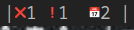

# better_task_manager
A better task manager written in C. 

pretty highlights and runs off of a simple csv.

## Quickstart

first, clone the repo
```bash
git clone https://github.com/SherllyNeo/better_task_manager.git
```
then 
```bash
cd better_task_manager && make && make install 
```
set path options in src/config.h

## Features
* Pretty coloured output 




* Add, Read and Remove tasks, no updating. So not CRUD.
* Runs off a plain CSV so your tasks are portable, syncable and awesome
* Uses my  so it has proper csv parsing


## Useage

```bash
  ____       _   _              _____         _
 | __ )  ___| |_| |_ ___ _ __  |_   _|_ _ ___| | __
 |  _ \ / _ \ __| __/ _ \ '__|   | |/ _` / __| |\/ /
 | |_) |  __/ |_| ||  __/ |      | | (_| \__ \   <
 |____/ \___|\__|\__\___|_|      |_|\__,_|___/_|\_\
  __  __
 |  \/  | __ _ _ __   __ _  __ _  ___ _ __
 | |\/| |/ _` | '_ \ / _` |/ _` |/ _ \ '__|
 | |  | | (_| | | | | (_| | (_| |  __/ |
 |_|  |_|\__,_|_| |_|\__,_|\__, |\___|_|
                           |___/

Must have at least two arguements
--help          -h      Help
--upcoming      -u      Prints status bar summary |❌8 ❗5  📅0 |
--list          -l      Lists tasks with colour coded urgency
--add           -a      Add task like so btm --add -n "name" -t "task desc" -d "YYYY-mm-dd"
--remove        -r      Remove task like so btm --remove "name"
```
